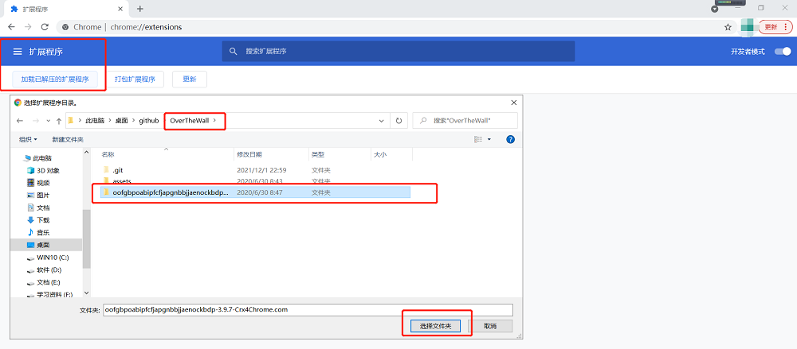
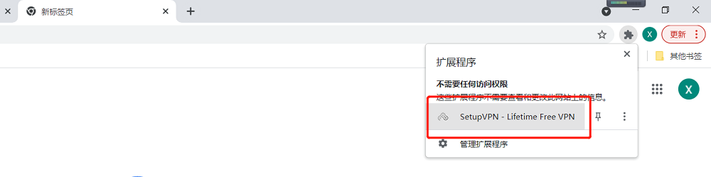
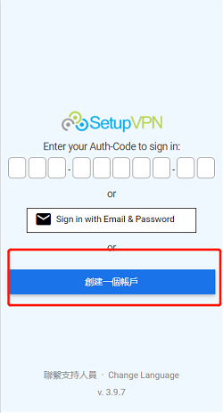
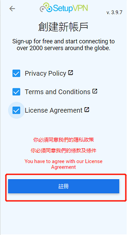
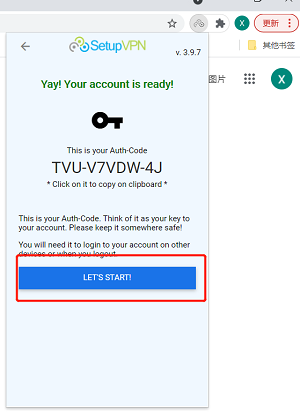
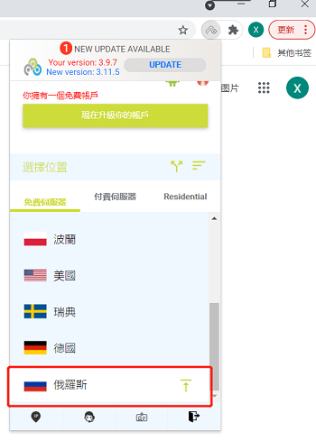
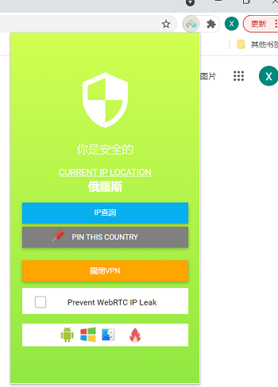
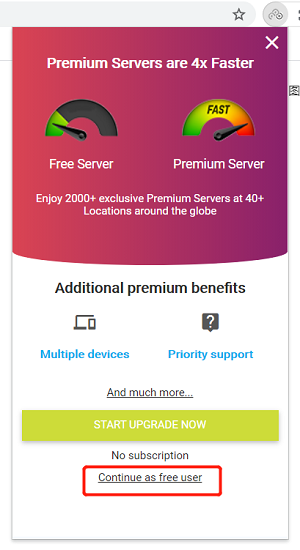

## 免费翻墙指南

#### 方法一/版本更新3.9.7（五步chrome插件法/360浏览器/只会在浏览器生效）：

#### 看不到图片的，<a href='https://github.com/ben1234560/OverTheWall/blob/master/README%EF%BC%88%E7%9C%8B%E4%B8%8D%E5%88%B0%E5%9B%BE%E7%89%87%E7%9C%8B%E8%BF%99%E4%B8%AA%E6%88%96%E8%80%85%E4%B8%8B%E8%BD%BD%EF%BC%89.pdf'>点我或者下载下来看</a>

#### 1. 首先下载一个chrome（我是用电脑管家下载）

<a href='https://www.google.cn/intl/zh-CN/chrome/'>点我下载官网chrome</a>  https://www.google.cn/intl/zh-CN/chrome/

#### 2.进入chrome的扩展程序（或Google浏览器输入：chrome://extensions/）

#### 3.选择要扩展程序

#### 3.使用扩展程序

#### 4.点击想要的国家，成功！

#### 完成！你现在可以用Google了

#### 如果网络很差的，可以切换到其它的国家代理，如荷兰等地

关于下一次使用提示这个界面，直接点击红框内的Continue as free user继续白嫖

本专题并不用于商业用途，转载请注明本专题地址，如有侵权，请务必邮件通知作者。

代码为外部代码，目前本人使用暂未发现病毒提示，请亲们注意哦。

Email：909336740@qq.com

PS：如你尝试有效并喜欢，欢迎点赞，如你尝试失败请联系我。

