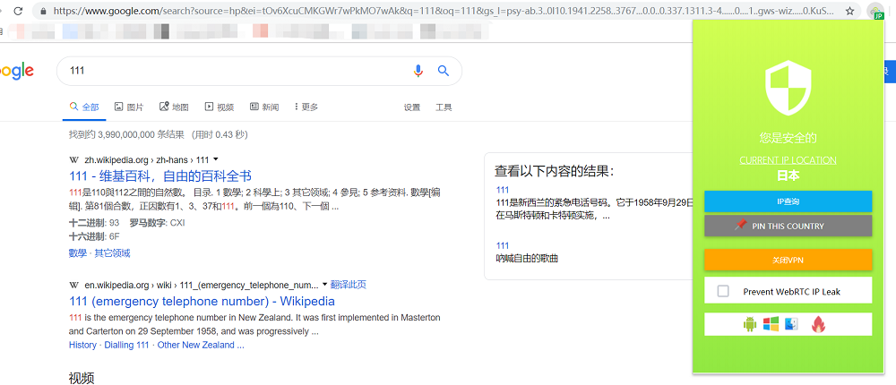
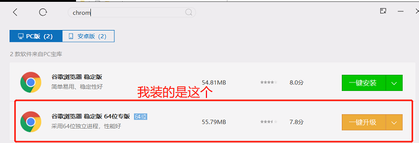

## 免费翻墙指南

#### 成品图（5步完成免费翻墙），免费支持（无利益相关）

#### 看不到图片的，<a href='https://github.com/ben1234560/OverTheWall/blob/master/README%EF%BC%88%E7%9C%8B%E4%B8%8D%E5%88%B0%E5%9B%BE%E7%89%87%E8%AF%B7%E7%9C%8B%E8%BF%99%E4%B8%AA%EF%BC%89.pdf'>点我</a>

#### 如果你使用了我上传的文件夹 SetupVPN 且有chrome，请直接跳到第4步

1. #### 首先下载一个chrome（我是用电脑管家下载）

   
<a href='https://www.google.cn/intl/zh-CN/chrome/'>点我下载官网chrome</a>

2. #### 去这个网址下载插件<https://www.crx4chrome.com/crx/36007/>

   

3. #### 新建文件夹，将文件放进去

   

4. #### 按照以下方式扩展到chrome

   

   

   

5. #### 注册并选择服务器

#### 完成！你现在可以用Google了

#### 如果网络很差的，可以切换到其它的国家代理，如荷兰等地

本专题并不用于商业用途，转载请注明本专题地址，如有侵权，请务必邮件通知作者。

代码为外部代码，目前本人使用暂未发现病毒提示，请亲们注意哦。

Email：909336740@qq.com

QQ：909336740

PS：如你尝试有效并喜欢，欢迎点赞，如你尝试失败请联系我。

