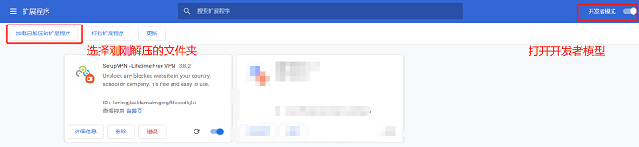

## 免费翻墙指南

#### 成品图（两步完成免费翻墙），免费支持（无利益相关/最下面有聊天截图）

#### 方法一（暂不可用，请使用方法二/两步懒人法/网络稳定）：

1. 把Shadowsocks-4.1.4.zip文件下载下来

   

2. 双击运行压缩包内Shadowsocks.exe红框内文件，有提示同意即可

   

3. 任意浏览器访问外网即可

   

#### 方法二/版本更新3.9.7（五步chrome插件法/360浏览器/只会在浏览器生效）：

#### 看不到图片的，<a href='https://github.com/ben1234560/OverTheWall/blob/master/README%EF%BC%88%E7%9C%8B%E4%B8%8D%E5%88%B0%E5%9B%BE%E7%89%87%E7%9C%8B%E8%BF%99%E4%B8%AA%E6%88%96%E8%80%85%E4%B8%8B%E8%BD%BD%EF%BC%89.pdf'>点我或者下载下来看</a>

1. #### 首先下载一个chrome（我是用电脑管家下载）

   
<a href='https://www.google.cn/intl/zh-CN/chrome/'>点我下载官网chrome</a>  https://www.google.cn/intl/zh-CN/chrome/

2. #### 去这个网址下载插件<https://www.crx4chrome.com/crx/36007/>

   

   > 目前最新版本已更新至3.9.7

3. #### 新建文件夹，将文件解压进去

   

4. #### 按照以下方式扩展到chrome

   

   

   

   

5. #### 注册并选择服务器

#### 完成！你现在可以用Google了

#### 如果网络很差的，可以切换到其它的国家代理，如荷兰等地

##### 最新支持截图，各位用的不错的话可以给我点个赞~谢谢

截图一：

截图二：

本专题并不用于商业用途，转载请注明本专题地址，如有侵权，请务必邮件通知作者。

代码为外部代码，目前本人使用暂未发现病毒提示，请亲们注意哦。

Email：909336740@qq.com

QQ：909336740

PS：如你尝试有效并喜欢，欢迎点赞，如你尝试失败请联系我。

